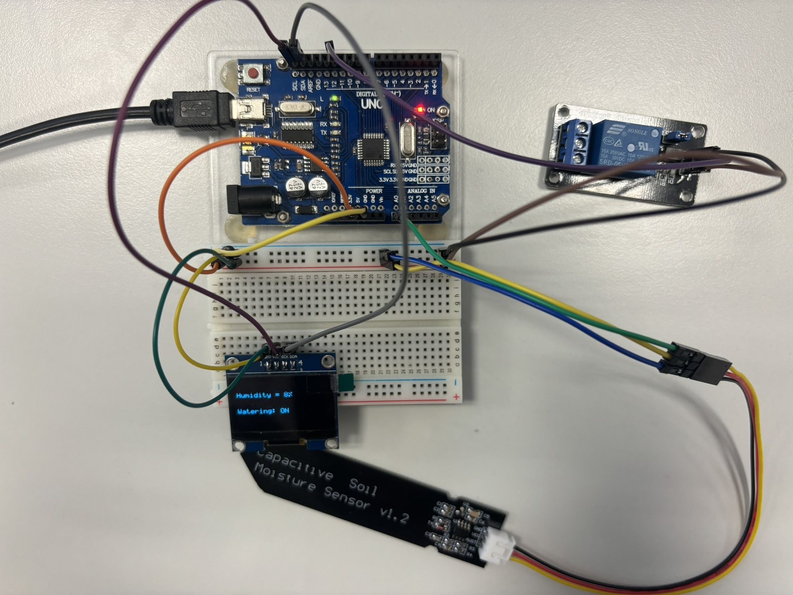
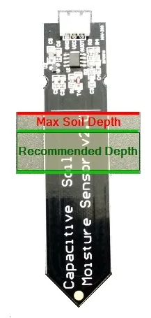

# Chytrý systém pro zavlažování se záznamníkem dat

### Autoři

* Jakub Fojtík
* Michal Lexa
* Jan Socha

Pozn. Na každé části projektu se podíleli všichni členové. 

## Teoretický popis

Cílem projektu bylo monitorovat vlhkost rostliny, zobrazovat ji na OLED displej a následně po překročení prahové hodnoty spínat relé, které spustí zavlažovací systém. Data jsou ze senzoru přiváděna analogovým signálem na mikrokontrolér a následně digitalizována analogově-digitálním převodníkem. Vlhkost je přepočítávána na relativní vlhkost, příčemž spodní hranici 0 % tvoří minimální hodnota, kterou se nám ve vzduchu experimentálně podařilo dosáhnout, a stejně tak horní hranici 100 % tvoří maximálně experimentálně dosažená vlhkost ve vodě. Tato hodnota je rovněž zobrazována na OLED displeji. Pakliže je hodnota relativní vlhkosti nižší než 40 %, spustí se relé, které funguje jako spínač zavlažovacího systému. Informace o stavu zavlažování je zobrazována na OLED displeji a zároveň ji indikuje zelená LED dioda na mikrokontroléru Arduino Uno. 

## Hardwarový popis

Senzor Capacitive Soil Moisture Sensor v1.2 užívaný pro měření vlhkosti má 3 piny - ground (0 V), VCC (3,3-5 V) a analog output - ty je potřeba správně připojit k mikrokontroléru. To lze provést například tak, jak je uvedeno na obrázku níže. Pro zobrazování vlhkosti je třeba připojit rovněž OLED displej a pro spouštění systému pak spínací relé. LED dioda se externě připojovat nemusí, poněvadž ji můžeme najít na Arduinu. Data do mikrokontroléru putují v podobě analogového signálu, jehož napěťové hodnoty jsou závislé na měřené vlhkosti. Díky využití zabudované LED diody je možné jednoduše připojit a ovládat relé pomocí pinu 13, který je zároveň spojen s LED. 

## Softwarový popis

O správnou činnost systému se stará Arduino Uno, jež je řízeno tímhle programem - https://github.com/MichalLexa/digital-electronics--2/blob/main/DE2-projekt/src/main.c. Nutné je použití knihoven pro timer, GPIO, UART a OLED. V samotném hlavním zdrojovém souboru je realizován analogově-digitální převodník, jenž řídí převod analogových napěťových hodnot do digitálních hodnot vlhkosti, které jsou následně normovány. V tomtéž souboru je vyřešeno i zobrazování na displej a indikování pomocí LED diody. Záznam dat je prováděn pomocí programu Microsoft Excel. Změřená data se automaticky vykreslují do grafu.

## Instrukce

Ke správnému fungování systému je zapotřebí nejdříve umístit senzor do pozorovaného prostředí, než celý systém spustíme. Měl by se zanořit pouze do hloubky doporučované výrobcem, aby nedošlo k případnému zkratu. Jakmile je senzor umístěn do lokace potřebné ke správnému monitorování vlhkosti rostliny, můžeme spustit systém, který pak zcela samostatně monitoruje stav v rostlině a zapíná zavlažování, pakliže je potřeba. 

## Zdroje

1. https://diyprojectslab.com/soil-moisture-sensor-v1-2-with-arduino/
2. https://makerselectronics.com/product/capacitive-soil-moisture-sensor-v2-0